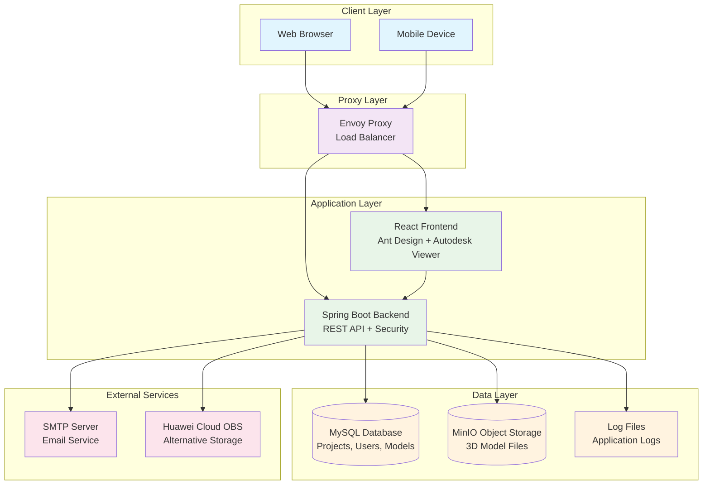
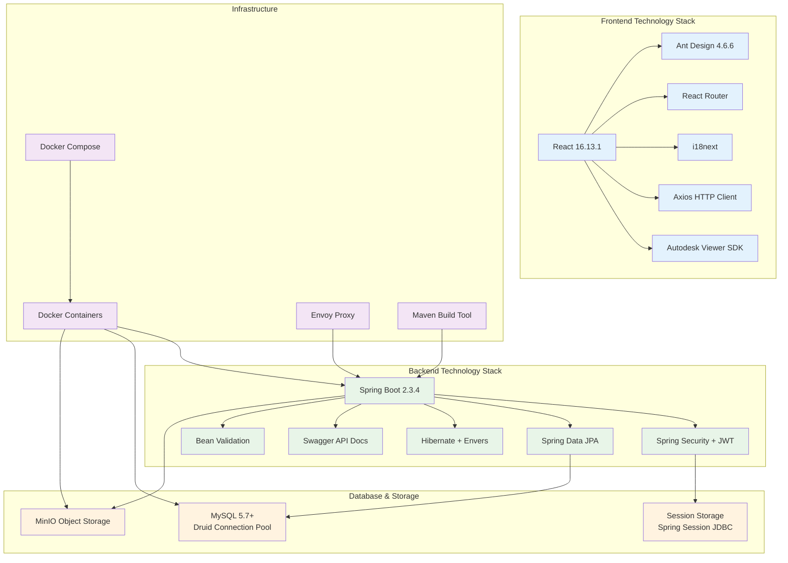
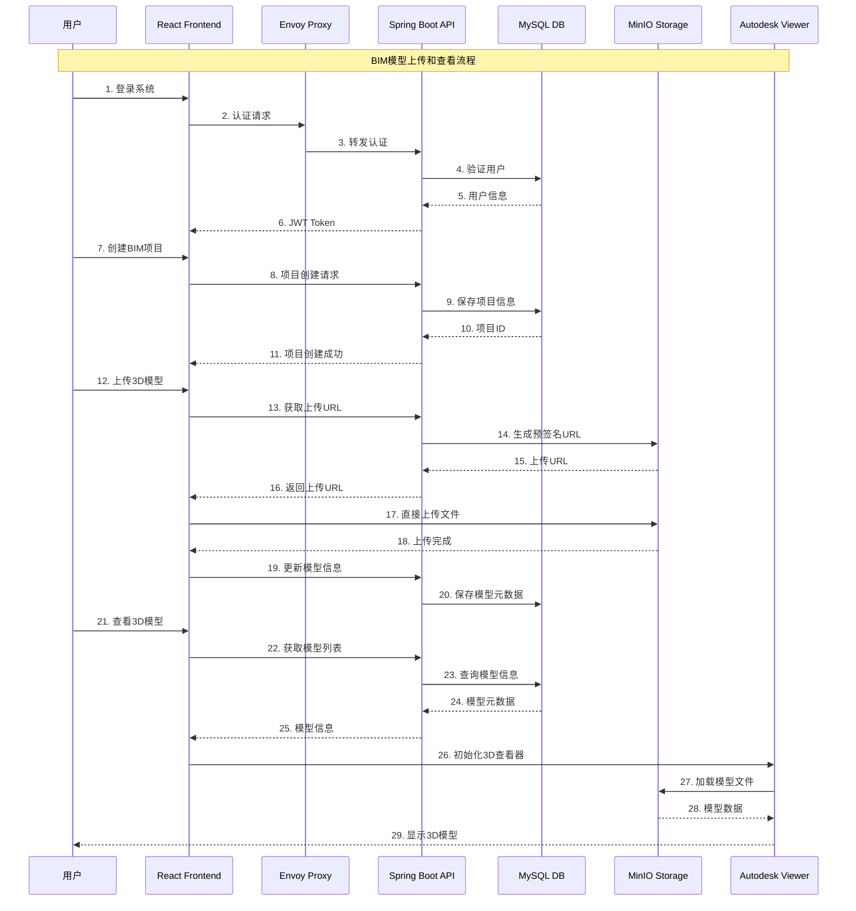

# MY BIM - 建筑信息模型平台

一个基于Spring Boot和React的现代化BIM（建筑信息模型）平台，支持3D模型上传、在线查看、项目管理和团队协作。

## 🚀 主要特性

### 核心功能
- **🏗️ BIM项目管理** - 创建、编辑、删除和组织BIM项目
- **📂 3D模型管理** - 支持多种3D模型格式的上传和管理
- **👀 在线3D查看** - 基于Autodesk Viewer的高性能3D模型查看
- **👥 用户权限管理** - 完整的用户认证和基于角色的权限控制
- **🔗 项目分享** - 生成分享链接，支持公开和私有分享
- **🏷️ 标签系统** - 灵活的标签管理和分类功能
- **🌐 多语言支持** - 支持中文和英文界面

### 技术特性
- **📱 响应式设计** - 适配各种设备和屏幕尺寸
- **⚡ 高性能存储** - 支持MinIO和华为云OBS等多种存储后端
- **🔐 安全认证** - JWT令牌认证和Spring Security集成
- **📊 数据审计** - 完整的操作日志和数据变更跟踪
- **🐳 容器化部署** - Docker和Docker Compose支持
- **📖 API文档** - 集成Swagger自动生成API文档

## 🛠️ 技术栈

### 后端技术
- **Java 8** - 编程语言
- **Spring Boot 2.3.4** - 应用框架
- **Spring Security** - 安全认证
- **Spring Data JPA** - 数据访问层
- **Hibernate Envers** - 数据审计
- **MySQL** - 关系型数据库
- **Druid** - 数据库连接池
- **JWT** - 身份认证令牌
- **Swagger** - API文档生成
- **Maven** - 构建工具

### 前端技术
- **React 16.13.1** - 前端框架
- **Ant Design 4.6.6** - UI组件库
- **React Router** - 路由管理
- **Axios** - HTTP客户端
- **i18next** - 国际化框架
- **Autodesk Viewer** - 3D模型查看器

### 基础设施
- **Docker & Docker Compose** - 容器化部署
- **Envoy Proxy** - 反向代理和负载均衡
- **MinIO** - 对象存储服务
- **华为云OBS** - 云存储服务（可选）

## 🏗️ 系统架构

### 整体架构图


### 技术栈架构图


### 业务流程时序图


## 📋 系统要求

- **Java**: 8+
- **Node.js**: 12.18.4+
- **MySQL**: 5.7+
- **Docker**: 19.03+
- **Docker Compose**: 1.25+

## 🚀 快速开始

### 1. 克隆项目
```bash
git clone <repository-url>
cd my-bim
```

### 2. 环境配置
创建 `.env` 文件：
```bash
# 数据库配置
MYSQL_ROOT_PASSWORD=your_mysql_password
MYSQL_TZ=Asia/Shanghai

# MinIO配置
MINIO_ACCESS_KEY=your_minio_access_key
MINIO_SECRET_KEY=your_minio_secret_key
MINIO_EXTERNAL_ENDPOINT=http://localhost:9000
```

### 3. 使用Docker Compose启动
```bash
# 构建并启动所有服务
docker-compose up -d

# 查看服务状态
docker-compose ps
```

### 4. 访问应用
- **前端应用**: http://localhost:8081
- **API文档**: http://localhost:8081/swagger-ui.html
- **MinIO控制台**: http://localhost:9001
- **数据库监控**: http://localhost:8081/druid

## 🔧 开发环境搭建

### 后端开发
```bash
# 启动MySQL和MinIO服务
docker-compose up mysql minio -d

# 在IDE中启动Spring Boot应用
# 或使用Maven命令
./mvnw spring-boot:run
```

### 前端开发
```bash
cd src/main/frontend

# 安装依赖
npm install

# 启动开发服务器
npm start
```

访问 http://localhost:3000 进行前端开发。

## 📁 项目结构

```
my-bim/
├── src/main/
│   ├── java/com/zjjqtech/bimplatform/     # Java源代码
│   │   ├── controller/                    # REST控制器
│   │   ├── service/                       # 业务逻辑层
│   │   ├── model/                         # 数据模型
│   │   ├── repository/                    # 数据访问层
│   │   └── security/                      # 安全配置
│   ├── resources/                         # 配置文件
│   └── frontend/                          # React前端应用
│       ├── src/
│       │   ├── components/               # React组件
│       │   ├── pages/                    # 页面组件
│       │   └── locales/                  # 国际化文件
│       └── public/
│           └── sdk/                      # Autodesk Viewer SDK
├── proxy/                                # Envoy代理配置
├── docker-compose.yaml                  # 容器编排配置
└── Dockerfile                           # 应用镜像构建文件
```

## 🔑 主要功能详解

### 用户管理
- 用户注册和登录
- 忘记密码和重置密码
- 基于角色的权限控制
- 用户个人信息管理

### 项目管理
- 创建和编辑BIM项目
- 项目权限管理（所有者、协作者）
- 项目标签和分类
- 项目搜索和筛选

### 模型管理
- 多格式3D模型上传
- 模型文件管理
- 主模型设置
- 模型重命名和删除

### 3D查看器
- 高性能3D模型渲染
- 多模型同时加载
- 视角控制和导航
- 构件选择和高亮
- 截图功能

### 分享功能
- 生成项目分享链接
- 支持公开和私有分享
- 分享权限控制

## 🔧 配置说明

### 数据库配置
在 `application.yml` 中配置MySQL连接：
```yaml
spring:
  datasource.druid:
    url: jdbc:mysql://mysql:3306/bim?serverTimezone=Asia/Shanghai
    username: root
    password: ${MYSQL_ROOT_PASSWORD}
```

### 存储配置
支持MinIO和华为云OBS：
```yaml
s3:
  endpoint: http://minio:9000
  accessKeyId: ${MINIO_ACCESS_KEY}
  accessKeySecret: ${MINIO_SECRET_KEY}
  bucketName: bim
```

### 邮件配置
用于密码重置功能：
```yaml
spring:
  mail:
    host: smtp.qq.com
    username: your_email@qq.com
    password: your_email_password
```

## 📊 监控和日志

### 数据库监控
访问 http://localhost:8081/druid 查看数据库连接池状态和SQL执行情况。

### 应用监控
Spring Boot Actuator提供健康检查和指标监控：
- 健康检查: `/actuator/health`
- 应用信息: `/actuator/info`

### 日志管理
- 开发环境：控制台输出
- 生产环境：文件日志（`./logs/application.log`）
- 支持日志轮转和压缩

## 🚀 部署指南

### 生产环境部署
1. 修改 `application.yml` 中的生产配置
2. 设置环境变量
3. 使用 `-Pprod` 配置文件构建：
   ```bash
   ./mvnw clean package -Pprod
   ```
4. 部署到服务器

### 负载均衡
使用Envoy代理实现负载均衡和反向代理，配置文件位于 `proxy/envoy.yaml`。

## 🧪 测试

### 运行单元测试
```bash
./mvnw test
```

### 运行集成测试
```bash
./mvnw verify
```

## 📚 API文档

在开发模式下，可以访问 http://localhost:8081/swagger-ui.html 查看完整的API文档。

主要API端点：
- `/api/bim-project` - 项目管理
- `/api/user` - 用户管理
- `/api/tag` - 标签管理
- `/api/message` - 消息管理

## 🤝 贡献指南

1. Fork项目
2. 创建特性分支 (`git checkout -b feature/AmazingFeature`)
3. 提交更改 (`git commit -m 'Add some AmazingFeature'`)
4. 推送到分支 (`git push origin feature/AmazingFeature`)
5. 创建Pull Request

## 📄 许可证

本项目采用 [MIT License](LICENSE) 开源许可证。

## 📞 联系我们

如有问题或建议，请通过以下方式联系：
- 创建 Issue
- 发送邮件至项目维护者

---

**注意**: 本项目仅用于学习和研究目的。在生产环境中使用前，请确保进行充分的安全性评估和测试。
